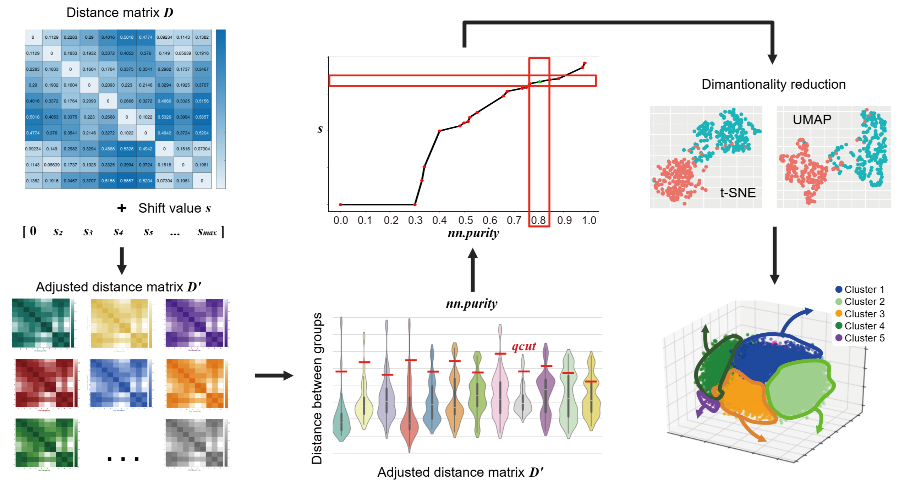

# SuperEmbed

**Supervised distance adjustment for embedding and visualization**

**SuperEmbed** is an R package for supervised adjustment of distance matrices before downstream dimensionality reduction or clustering. The repository is named `SuperEmbed`; the current R package name used in `DESCRIPTION` is `superTSNE`.

**SuperEmbed** 是一个用于在降维或聚类前进行有监督距离矩阵调整的 R 包。本仓库名为 `SuperEmbed`，当前 `DESCRIPTION` 中的 R 包名为 `superTSNE`。



## English

### Overview

SuperEmbed performs supervised adjustment of a distance matrix using known sample labels. The core idea is to add a shift value `s` to distances between samples from different classes, so that samples sharing the same label are encouraged to stay closer in downstream t-SNE, UMAP, clustering, or other distance-based analyses.

The package is designed for visualization workflows where known biological or experimental labels should be reflected more clearly, such as cell types, disease states, treatment groups, or batch-aware exploratory analysis. Users can either provide a fixed shift value `s` or estimate it from a target nearest-neighbor purity (`nn.purity`).

### Workflow

1. Provide an expression matrix `mat` or a precomputed distance matrix `dmat`.
2. Use `class.labels` to identify within-class and between-class sample pairs.
3. Add a shift value `s` to between-class distances.
4. Return the adjusted distance matrix `D'`.
5. Use `D'` for t-SNE, UMAP, clustering, or other distance-based downstream methods.

### Installation

```r
install.packages("devtools")
devtools::install_github("FangZY-Lab/SuperEmbed")
library(superTSNE)
```

### Dependencies

SuperEmbed depends on the following R packages:

- `Rfast`
- `matrixStats`

These dependencies should be installed automatically when installing SuperEmbed from GitHub. If needed, they can also be installed manually:

```r
install.packages(c("Rfast", "matrixStats"))
```

`devtools` is only required for installing the package from GitHub.

### Quick Start

If a suitable shift value `s` is already known, use:

```r
set.seed(1)

mat <- matrix(rnorm(100 * 60), nrow = 100, ncol = 60)
class.labels <- rep(c("Cluster 1", "Cluster 2", "Cluster 3"), each = 20)

dmat.super <- aux_get_dist_super(
  mat = mat,
  class.labels = class.labels,
  s = 10
)
```

To estimate `s` from a target nearest-neighbor purity:

```r
dmat.super <- aux_test_dist_super(
  mat = mat,
  class.labels = class.labels,
  nn.purity = 0.8,
  k = 10,
  n = 50
)
```

To return the relationship between shift values and nearest-neighbor purity:

```r
stat <- aux_test_dist_super(
  mat = mat,
  class.labels = class.labels,
  nn.purity = 0.8,
  k = 10,
  n = 50,
  ret.stat = TRUE
)
```

### Main Functions

| Function | Description |
| --- | --- |
| `aux_get_dist_super()` | Generates a supervised adjusted distance matrix when the shift value `s` is provided. |
| `aux_test_dist_super()` | Generates a supervised adjusted distance matrix using either a fixed `s` or a target `nn.purity`; it can also return the relationship between `s` and purity. |

### Input Format

- `mat`: A matrix or data frame with variables in rows and samples in columns.
- `dmat`: A precomputed distance matrix, used as an alternative to `mat`.
- `class.labels`: A vector of sample labels. Its length must match the number of samples.
- `s`: The shift value added to distances between samples from different classes.
- `nn.purity`: Target nearest-neighbor purity, typically between 0 and 1.

## 中文说明

### 简介

SuperEmbed 用于根据样本标签对原始距离矩阵进行监督式调整。它通过给不同类别之间的距离加入一个 shift value `s`，使同类样本在后续 t-SNE、UMAP 或聚类分析中更倾向于靠近，同时保留原始距离结构中的主要信息。

该方法适用于需要在可视化中突出已知生物学分组、细胞类型、疾病状态或实验分组差异的场景。用户可以直接指定 `s`，也可以通过目标 nearest-neighbor purity (`nn.purity`) 自动估计合适的 `s`。

### 方法概览

1. 输入表达矩阵 `mat` 或已计算好的距离矩阵 `dmat`。
2. 根据 `class.labels` 判断样本对是否属于同一类别。
3. 对不同类别之间的距离加入 shift value `s`。
4. 得到调整后的距离矩阵 `D'`。
5. 将 `D'` 用于 t-SNE、UMAP、聚类或其他基于距离矩阵的下游分析。

### 安装

```r
install.packages("devtools")
devtools::install_github("FangZY-Lab/SuperEmbed")
library(superTSNE)
```

### 依赖

SuperEmbed 需要以下 R 包：

- `Rfast`
- `matrixStats`

通过 GitHub 安装 SuperEmbed 时，这些依赖通常会自动安装。如果需要，也可以手动安装：

```r
install.packages(c("Rfast", "matrixStats"))
```

`devtools` 只是在从 GitHub 安装本包时需要，并不是 SuperEmbed 的运行依赖。

### 快速开始

如果已经知道合适的 `s`，可以直接生成监督调整后的距离矩阵：

```r
set.seed(1)

mat <- matrix(rnorm(100 * 60), nrow = 100, ncol = 60)
class.labels <- rep(c("Cluster 1", "Cluster 2", "Cluster 3"), each = 20)

dmat.super <- aux_get_dist_super(
  mat = mat,
  class.labels = class.labels,
  s = 10
)
```

如果希望根据目标 nearest-neighbor purity 自动估计 `s`：

```r
dmat.super <- aux_test_dist_super(
  mat = mat,
  class.labels = class.labels,
  nn.purity = 0.8,
  k = 10,
  n = 50
)
```

也可以返回不同 `s` 与 nearest-neighbor purity 之间的对应关系：

```r
stat <- aux_test_dist_super(
  mat = mat,
  class.labels = class.labels,
  nn.purity = 0.8,
  k = 10,
  n = 50,
  ret.stat = TRUE
)
```

### 主要函数

| 函数 | 说明 |
| --- | --- |
| `aux_get_dist_super()` | 在给定 shift value `s` 的情况下生成监督调整后的距离矩阵。 |
| `aux_test_dist_super()` | 根据 `s` 或目标 `nn.purity` 生成监督调整后的距离矩阵，也可返回 `s` 与 purity 的对应关系。 |

### 输入格式

- `mat`: 数据矩阵或数据框，行表示变量，列表示样本。
- `dmat`: 已计算好的距离矩阵，可作为 `mat` 的替代输入。
- `class.labels`: 样本类别标签，长度必须等于样本数。
- `s`: 加到不同类别样本对距离上的 shift value。
- `nn.purity`: 目标 nearest-neighbor purity，取值范围通常为 0 到 1。

## License

This project is released under the MIT license. See [LICENSE](LICENSE) for details.
